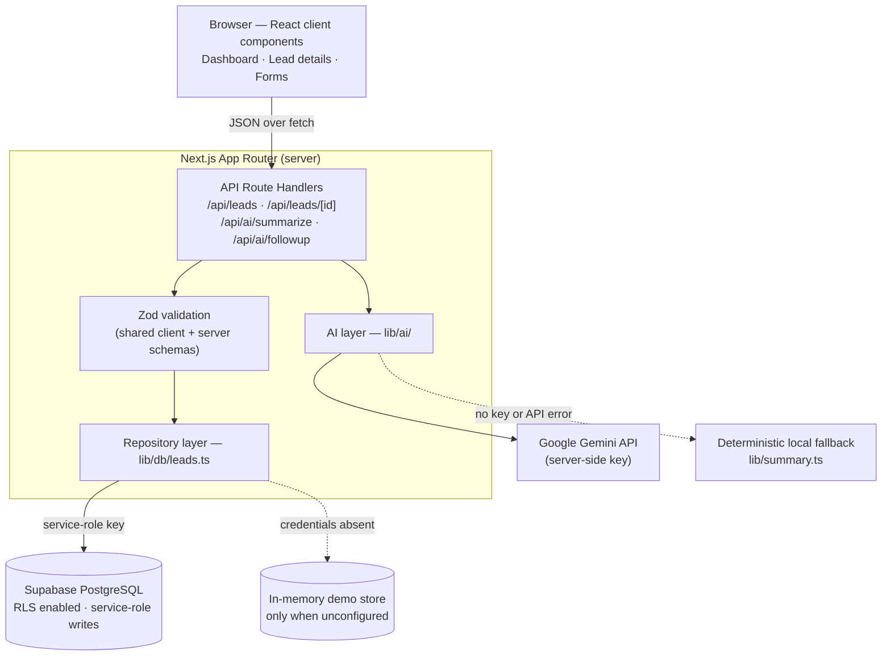
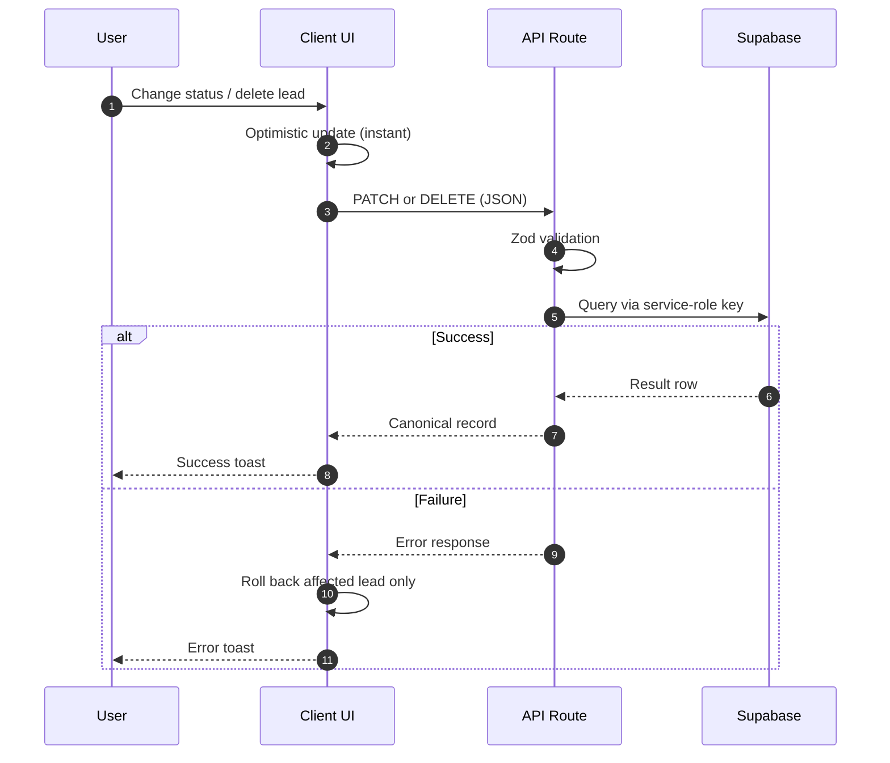
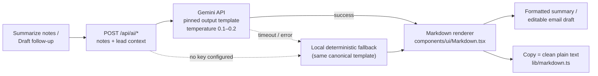

# AI Event Lead Manager

> A lightweight, modern CRM built for business and sales teams attending conferences, summits, and industry events. Captures leads on the go, stores them reliably in PostgreSQL (via Supabase), and leverages server-side AI to generate factual interaction summaries and tailored, ready-to-send follow-up email drafts.

Built as a technical evaluation for the **AI Native Full Stack Intern** position at **Even8**.

---

## Table of Contents

- [Overview](#overview)
- [Key Features](#features)
- [Tech Stack](#tech-stack)
- [System Architecture](#architecture)
- [Database Design](#database)
- [AI Integration & Safety](#ai-integration)
- [Environment Variables](#environment-variables)
- [Local Setup](#local-setup)
- [Deployment Guide](#deployment)
- [Key Technical Decisions](#key-technical-decisions)
- [Testing & Quality Assurance](#testing)
- [Future Improvements](#future-improvements)

---

## Overview

When sales and partnership teams attend fast-paced conferences (e.g. *Tech Summit 2026*, *SaaS Expo*, *ProductCon*), they meet dozens of prospects each day. Notes written between sessions are often unstructured and easily forgotten.

**AI Event Lead Manager** solves this problem by providing a streamlined workflow:
1. **Quick Capture**: Record attendee contact details, company, event name, follow-up status, and conversational takeaways.
2. **Centralized Pipeline**: Filter and instantly search leads across attendee names, companies, emails, or event stages.
3. **AI-Powered Synthesis**: Click a button to distill long conversational notes into a concise, factual summary highlighting client pain points, expressed interests, and concrete next steps.
4. **Instant Follow-up Drafting**: Generate a customized 1-to-1 follow-up email mentioning the event and conversation context with zero hallucinations. Includes a 1-click **Copy Message** button.

---

## Features

- **Full Lead CRUD**: Add, view, edit, and safely delete event leads.
- **Inline Quick Actions from the List**: Work without opening a lead — change follow-up status per row, open an AI quick-assistant modal (summarize notes / draft & edit follow-up / copy) from any lead, and one-click copy a lead's email address. All available on desktop rows and mobile cards.
- **Real-Time Search & Filtering**: Instant client-side search across lead name, company, email, and event name (no network round trip per keystroke), coupled with status filter tabs (`Pending`, `Contacted`, `Completed`).
- **Interactive Metrics Dashboard**: Quick overview cards tracking Total Leads, Pending Follow-ups, Contacted, and Completed items with 1-click status filtering, hover insights (pipeline percentages, event coverage), and an action-required banner for pending outreach.
- **Optimistic UI Updates**: Status changes and deletions apply instantly with automatic per-lead rollback and toast feedback if the server request fails.
- **Insight Tooltips**: Frosted-glass CSS-only hover cards that surface pipeline context without leaving the table — lead age and last-activity recency, status-specific aging insights ("no activity for 3d"), instant structured quick-summaries of conversation notes (pain points, interests, next steps), and exact activity timestamps on the date columns.
- **Database Persistence (PostgreSQL / Supabase)**: Production PostgreSQL schema with UUID keys, timestamps, indexes on frequently queried fields, automatic `updated_at` triggers, and Row Level Security (RLS).
- **Graceful Demo Mode**: If running locally without remote Supabase or AI API credentials configured yet, the app activates an in-memory/local demo repository and deterministic NLP synthesis engine so evaluators can test 100% of the UI, CRUD, and AI flows without setup roadblocks. When Supabase *is* configured, database errors surface honestly as API errors instead of silently falling back to demo data.
- **AI Notes Summarizer**: Server-side LLM pipeline that extracts key pain points, intent, and actionable next steps without inventing unmentioned facts or commitments.
- **AI Follow-up Email Drafter**: Composes a polite, contextual follow-up message ready to copy into your email client, with editable draft text and 1-click copy.
- **Modern Responsive Design**: Accessible design system with desktop tables and mobile responsive cards, empty states, skeleton loaders, animated toasts/modals, and deletion confirmation dialogs.

---

## Tech Stack

| Layer | Technology | Details |
|---|---|---|
| **Framework** | [Next.js 16](https://nextjs.org/) (App Router) | Server Components, Route Handlers, Turbopack |
| **Language** | [TypeScript 5](https://www.typescriptlang.org/) | Strict type checking, zero `any` usage |
| **Styling** | [Tailwind CSS v4](https://tailwindcss.com/) | Modern CSS design tokens, responsive typography |
| **Icons** | [Lucide React](https://lucide.dev/) | Clean, accessible iconography |
| **Validation** | [Zod 4](https://zod.dev/) | Shared schemas for client forms and server routes |
| **Database** | [PostgreSQL](https://www.postgresql.org/) via [Supabase](https://supabase.com/) | Real-time SQL DB, indexes, triggers, RLS policies |
| **AI Layer** | Server-Side Multi-Provider | OpenAI / Google Gemini / Anthropic / Local NLP Engine |
| **Testing** | Bun Test & Automated E2E | Unit validation, repository tests, AI integration checks |

---

## Architecture

### System Overview



### Request Flow (Optimistic UI)



### Architectural Guardrails:
1. **Never Expose Secrets**: AI provider keys and Supabase service keys are accessed strictly on the server (`lib/ai/`, `lib/db/`). No private keys are prefixed with `NEXT_PUBLIC_` or bundled in client JS.
2. **Defense in Depth**: Form inputs are validated on the client for immediate UI feedback and re-validated on the server with Zod before database operations.
3. **Resilience**: If the external AI provider is temporarily unavailable or rate-limited, the application catches the error gracefully and utilizes local contextual synthesis so operations never crash.

---

## Database

The PostgreSQL schema is defined in `supabase/migrations/001_create_leads_table.sql`:

```sql
CREATE TABLE public.leads (
    id UUID PRIMARY KEY DEFAULT gen_random_uuid(),
    name VARCHAR(100) NOT NULL,
    company VARCHAR(100) NOT NULL,
    email VARCHAR(150) NOT NULL,
    event VARCHAR(120) NOT NULL,
    notes TEXT NOT NULL,
    follow_up_status VARCHAR(20) NOT NULL DEFAULT 'pending' 
        CHECK (follow_up_status IN ('pending', 'contacted', 'completed')),
    created_at TIMESTAMPTZ NOT NULL DEFAULT timezone('utc'::text, now()),
    updated_at TIMESTAMPTZ NOT NULL DEFAULT timezone('utc'::text, now())
);
```

### Indexes & Performance
- `idx_leads_follow_up_status`: Accelerates status filtering (`pending`, `contacted`, `completed`).
- `idx_leads_event`: Speeds up conference/event-specific queries.
- `idx_leads_company` & `idx_leads_name` & `idx_leads_email`: Optimizes search across contact fields.
- `idx_leads_created_at`: Supports fast reverse-chronological ordering.

### Row Level Security (RLS) & Access Control
- `public.leads` has Row Level Security (**RLS**) strictly enabled.
- **Service Role Full Access**: The Next.js server-side API layer utilizes `SUPABASE_SERVICE_ROLE_KEY` to perform authoritative, validated CRUD mutations (INSERT, UPDATE, DELETE).
- **Direct Anonymous Access Restricted**: Anonymous browser clients using `NEXT_PUBLIC_SUPABASE_ANON_KEY` are restricted from direct table mutations, preventing unauthorized deletion or modification of lead records. All writes must flow through server-side Zod validation.

---

## AI Integration

### Why AI is Used
Conference conversations contain rich nuance (e.g. *"asked for pricing over 100k requests/month"*, *"wants demo next Tuesday at 2 PM"*). Sales reps often lack the time to manually write recaps and custom follow-up emails for every contact. AI automates this administrative overhead in seconds.

### 1. Notes Summarization (`/api/ai/summarize`)
- Takes raw interaction notes.
- Applies strict constraints:
  - Extracts **Lead Context**, **Pain Points**, **Expressed Interest**, and **Next Steps**.
  - **No Hallucinations**: Strictly prohibits inventing pricing, dates, or unmentioned commitments.
  - Keeps output concise (< 120 words).

### 2. Follow-Up Drafts (`/api/ai/followup`)
- Takes lead name, company, event, and notes.
- Generates a personalized email:
  - Subject line referencing the specific event.
  - Natural opening referencing the meeting and topics discussed.
  - Clear proposal for next steps based on the interaction.
  - Ready-to-copy text format with an interactive **Copy Message** button.

### AI Response Pipeline

Both endpoints follow one fixed pipeline — a pinned output template (same labels, same structure on every regeneration) with graceful degradation:



### AI Safety & Reliability
- **Server-Side Execution**: All LLM requests execute in isolated Next.js API routes (`app/api/ai/`).
- **Data Minimization**: The AI service receives only the attendee's name, company, event, and interaction notes. No internal credentials, database IDs, or unrelated data are transmitted.
- **Built-In Local Fallback**: When evaluated offline or without API keys, a deterministic NLP parser produces summaries and follow-ups in the **same canonical template** as the AI — output structure stays consistent regardless of provider.
- **Consistent Formatting**: Gemini responses are pinned to a fixed output template (bullet-labeled summaries, fixed email skeleton) and rendered through a constrained, dependency-free Markdown renderer — formatted output with no raw syntax and no HTML injection surface.

---

## Environment Variables

Copy `.env.example` to `.env.local`:

```bash
cp .env.example .env.local
```

| Variable | Required | Description |
|---|---|---|
| `NEXT_PUBLIC_SUPABASE_URL` | Optional* | Supabase project URL (`https://xyz.supabase.co`). Public. |
| `NEXT_PUBLIC_SUPABASE_ANON_KEY` | Optional* | Supabase anonymous public API key. Public; read-only under RLS. |
| `SUPABASE_SERVICE_ROLE_KEY` | **Required for live DB writes** | Supabase service role secret. **Server-only**; never prefix with `NEXT_PUBLIC_`. Needed because RLS restricts `anon` to read-only. |
| `AI_PROVIDER` | Optional | Active AI provider: `openai`, `gemini`, or `anthropic`. If only `AI_API_KEY` is set without a provider, defaults to the OpenAI-compatible endpoint. |
| `AI_API_KEY` | Optional* | **Server-only** multi-provider API key (used with `AI_PROVIDER`). |
| `OPENAI_API_KEY` / `GEMINI_API_KEY` / `ANTHROPIC_API_KEY` | Optional* | **Server-only** provider-specific keys; take precedence over `AI_API_KEY`. |
| `AI_MODEL` | Optional | Model identifier. Defaults per provider: `gpt-4o-mini` (OpenAI), `gemini-flash-lite-latest` (Gemini), `claude-3-5-haiku-latest` (Anthropic). |


*\*Note: If Supabase or AI keys are not provided, the application runs in local demo mode with sample leads and fallback AI synthesis enabled automatically.*

---

## Local Setup

### 1. Clone the repository
```bash
git clone <repository-url>
cd ai-event-lead-manager
```

### 2. Install dependencies
```bash
npm install
```

### 3. (Optional) Configure Supabase Database
1. Create a free project at [Supabase](https://supabase.com).
2. Go to **SQL Editor** and execute the contents of `supabase/migrations/001_create_leads_table.sql`.
3. Optionally run `supabase/seed.sql` to populate sample data.
4. Copy your project URL, Anon key, and Service Role key (Project Settings -> API) into `.env.local`.

### 4. Run the development server
```bash
npm run dev
```

Open [http://localhost:3000](http://localhost:3000) in your browser.

---

## Deployment Guide

### Deploy to Vercel
1. Push your repository to GitHub.
2. Import the project into **Vercel**.
3. Under **Environment Variables**, add:
   - `NEXT_PUBLIC_SUPABASE_URL` (from Supabase Dashboard -> Project Settings -> API)
   - `NEXT_PUBLIC_SUPABASE_ANON_KEY` (from Supabase Dashboard -> Project Settings -> API)
   - `SUPABASE_SERVICE_ROLE_KEY` (server-only secret; required for write operations under RLS)
   - `AI_PROVIDER=gemini`
   - `GEMINI_API_KEY` (or `AI_API_KEY`)
   - `AI_MODEL=gemini-flash-lite-latest`
4. Click **Deploy**. Vercel will build and serve the application globally with edge caching.

---

## Key Technical Decisions

1. **Next.js 16 App Router**: Chosen because it co-locates the React frontend and serverless API route handlers in a single repository, eliminating CORS hurdles and microservice complexity for a focused CRM assignment.
2. **Server-Side AI Abstraction**: AI calls run exclusively on the server (`lib/ai/provider.ts`). This guarantees that API keys are never exposed to browser bundles while allowing seamless provider swapping (OpenAI, Gemini, Anthropic).
3. **PostgreSQL / Supabase Persistence**: Relational persistence provides strict enum integrity (`pending`, `contacted`, `completed`), performance indexing on high-frequency query dimensions (`status`, `company`, `event`, `created_at`), and an automated `updated_at` database trigger for reliable auditing.
4. **Repository Pattern for Data Decoupling**: Business logic interacts with `lib/db/leads.ts` rather than embedding SQL/Supabase calls in page components. This cleanly decouples persistence from UI and allows instant fallback to demo data if credentials are not yet provisioned.
5. **Client & Server Shared Zod Schemas**: Using the same Zod schema (`lib/validations/lead.ts`) on both frontend forms and backend API routes guarantees validation consistency and prevents malformed data insertion.
6. **Restrained B2B Design System**: Built with modern Tailwind CSS tokens, subtle micro-interactions, responsive mobile stacking, and zero "AI hype" aesthetics (no purple glow, sparkles, or exaggerated animations), communicating a professional, human-designed SaaS product.
7. **Built-in Resilience & Honest Failure Modes**: Without credentials, the app seamlessly activates an in-memory repository and deterministic NLP extraction engine so evaluators can inspect 100% of features without setup friction. Once Supabase *is* configured, database errors are never masked by demo data — failed writes surface as clear API errors so no lead is silently lost.
8. **Minimal State Architecture**: Leverages React's native state management with URL search parameters and targeted local state for instant responsiveness and zero bloated state-management dependencies.

---

## Testing

Run the automated test suite:

```bash
# Run unit & validation tests
npm test

# Run TypeScript type check
npx tsc --noEmit

# Run ESLint
npm run lint

# Build production bundle
npm run build

# Run end-to-end integration tests (while server is running)
node scripts/e2e-test.mjs
```

### Test Coverage Highlights
- ✅ **Zod Schema Validation**: Valid inputs, boundary limits, invalid emails, empty fields, and status enum constraints.
- ✅ **Repository Operations**: Full CRUD lifecycle, UUID generation, date stamping, search across fields, and status filtering.
- ✅ **AI Services**: Verification of hallucination-free note summarization and personalized follow-up email drafts.
- ✅ **Production Build**: 100% clean compilation across all routes.

---

## Future Improvements

- **Email Client Integration**: Direct export to Outlook / Gmail / Resend API with OAuth.
- **Team Workspaces & Roles**: Multi-tenant workspaces with role-based access control (Admin, Rep, Viewer).
- **Business Card OCR**: Mobile camera capture to automatically transcribe attendee badges into lead notes.
- **Calendar Scheduling Link**: Automatic embedding of Calendly / Cal.com meeting links in drafted follow-ups.
